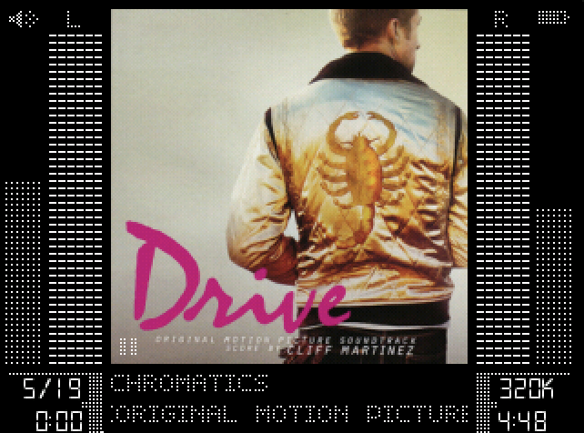

## Repo for Rockbox experiments

### DOTTY theme

Theme with a focus on album art inspired by OneBit theme from Ben Clayton and
based on SNAZZ3 by Vera B and on SPAZZ by CHUCK LARDO, SNAZZY by Phil Graves,
SNAZZ2 by Jihoon Kim

### Album art script

Script to extract album art from a music collection - resize it to 196x196 for
use with the DOTTY theme and then sync it to the ipod as `folder.jpg`. Not
necessary if all your album art already works as is.
